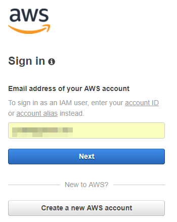

# Spinning up an AWS EC2 instance

Before we can start to play around with Docker, we need to have a server that will host it so we can play around, unrestricted from any coporate network constraints.

Spinning up an AWS EC2 instance is very straight forward, so let's go ahead:

Head over to the AWS console, by first signing in to [AWB Console Login](https://console.aws.amazon.com/?nc2=h_m_mc "AWB Console Login")

